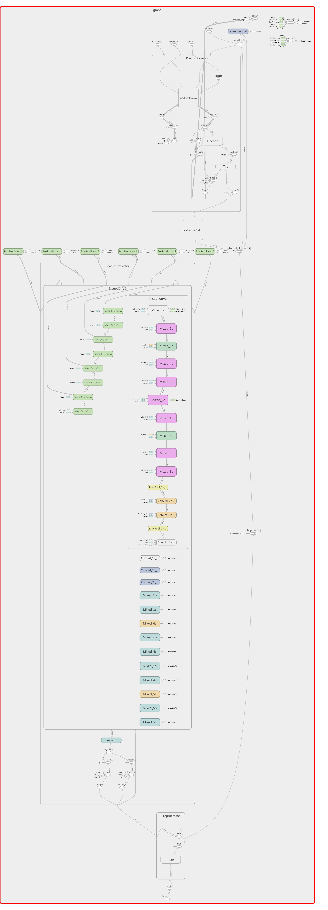
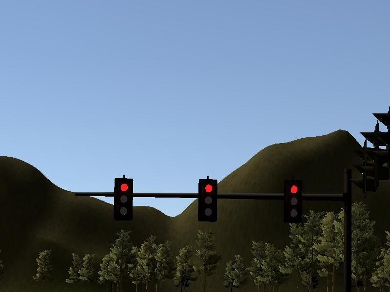
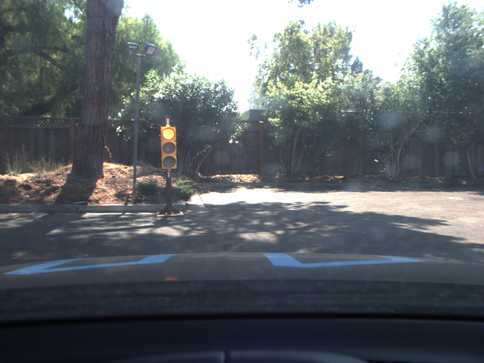
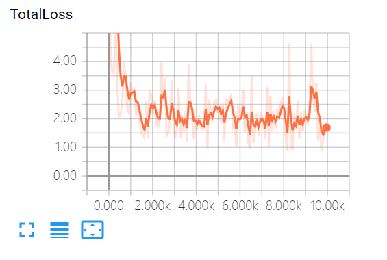
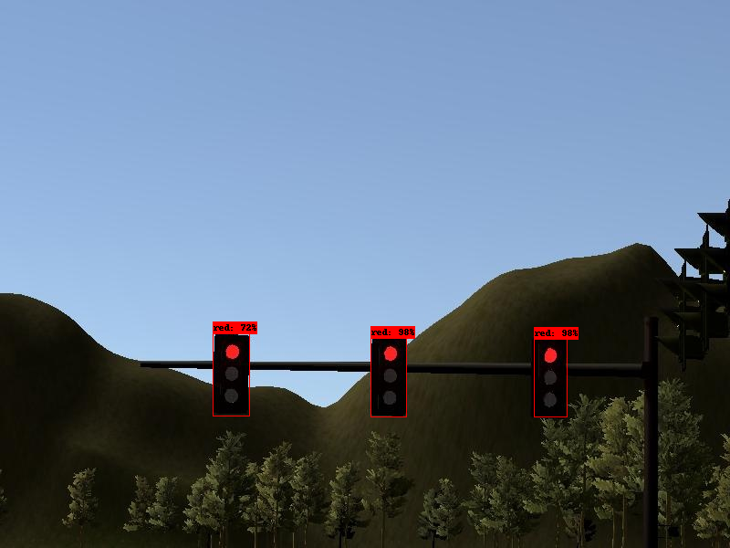
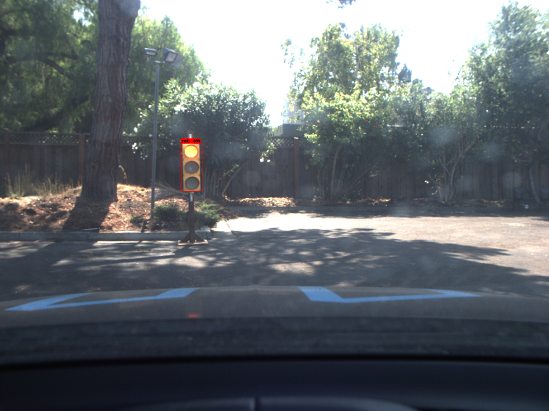

## The CarND Capstone Project
[](http://www.udacity.com/drive)

This project uses ROS nodes to implement core functionality of the autonomous vehicle system, including traffic light detection, control, and waypoint following! The code is tested using the [Udacity Simulator](https://github.com/udacity/CarND-Capstone/releases) and is executed on the Udacity self-driving car Carla.


### Results
The following video shows Carla autonomously driving along the *simulated highway track*. 
[](https://www.youtube.com/watch?v=tZso-BjW6cQ)

The sections within the video:
* **top left**: */image_color* the image that is published by the camera
* **top right**: a visualization of ROS topics 
  * white line: */base_waypoints* - the road according to a map 
  * balls red/yellow/green: */vehicle/traffic_lights* - ground truth status and location of the traffic lights (for debugging, from simulator)
  * green line: */final_waypoints* - the next waypoints the car should follow
  * blue cone: */current_pose* - location and orientation of the car
* **bottom left**: result from traffic light detection including prediction score
* **bottom right**: simulator 

The following video shows how our code runs a real self driving car with traffic light detection.
[](https://www.youtube.com/watch?v=bWpKIwP68RE)


*Note: Find the latest version of this project on
[Github](https://github.com/markbroerkens/CarND-Capstone).*


### Team Members
* Mark Brörkens: broerkens (at) gmail.com (team lead)
* Kapy Kangombe: kapambwe (at) gmail.com
* Utkarsh Dubey: utkarsh.dubey.26 (at) gmail.com
* Ji xiaojie: 33048399 (at) QQ.com
* Hapa Hassan: heba.ali90 (at) gmail.com

### Discussion and Outlook
The car follows the track very well if the hardware is powerful enough. The results video was created on a MacBook Pro with 2,8 GHz Intel Core i7. ROS was executed in the Linux VM from Udacity using VMWare Fusion. The Simulator was executed natively in Mac.

We did not manage to get the ROS code and simulator running in the Udacity Workspace. There seemed to be some delay between ROS and the simulator which resulted in leaving the track.

In order to reduce the load, we implemented the following tricks:
  * reduced the traffic light detection rate to 5 Hz
  * reduced the frequency if published images by the bridge to the simulator
  * disabled publishing of lidar and obstacles data
  
As a next step we could try to further improve the timing of the nodes and try to reduce ceffort for computation and communication.


## System Architecture
Description from Udacity Classroom
The following is a system architecture diagram showing the ROS nodes and topics used in the project. The ROS nodes and topics shown in the diagram are described briefly in the Code Structure section below.


### Code Structure
Below is a brief overview of the repo structure, along with descriptions of the ROS nodes. 

#### Traffic Light Detection Node
This package contains the traffic light detection node.


See training code in [/training/](https://github.com/markbroerkens/CarND-Capstone/tree/master/training/) and inference code in 
[/ros/src/tl_detector/](https://github.com/markbroerkens/CarND-Capstone/tree/master/ros/src/tl_detector/).


#### Waypoint Updater Node
This package contains the waypoint updater node


See code in [/ros/src/waypoint_updater/](https://github.com/markbroerkens/CarND-Capstone/tree/master/ros/src/waypoint_updater/).


#### Drive By Wire (DBW) Node
Carla is equipped with a drive-by-wire (dbw) system, meaning the throttle, brake, and steering have electronic control. This package contains the files that are responsible for control of the vehicle


See code in [/ros/src/twist_controller/](https://github.com/markbroerkens/CarND-Capstone/tree/master/ros/src/twist_controller/).

#### ROS to Simulator Bridge Node
A package that contains a server for communicating with the simulator, and a bridge to translate and publish simulator messages to ROS topics.

See code in [/ros/src/styx/](https://github.com/markbroerkens/CarND-Capstone/tree/master/ros/src/styx/).

#### Waypoint Loader Node
A package which loads the static waypoint data and publishes to */base_waypoints*

See code in [/ros/src/waypoint_loader/](https://github.com/markbroerkens/CarND-Capstone/tree/master/ros/src/waypoint_loader/).

  
#### Waypoint Follower Node
A package containing code from [Autoware](https://github.com/CPFL/Autoware) which subscribes to */final_waypoints* and publishes target vehicle linear and angular velocities in the form of twist commands to the */twist_cmd* topic.

See code in [/ros/src/waypoint_follower/](https://github.com/markbroerkens/CarND-Capstone/tree/master/ros/src/waypoint_follower/).


#### (debug) Visualisation Node
See code in [/ros/src/visualisation/](https://github.com/markbroerkens/CarND-Capstone/tree/master/ros/src/visualisation/).

*Thanks to [Eric Lavigne and Team-Wolf-Pack](https://github.com/ericlavigne/CarND-Capstone-Wolf-Pack) for their inspiring ideas regarding the visualization.*


## Training steps
Below is a brief overview of the traffic light detector training.

#### 1. Get the SSD model from [Tensorflow detection model zoo](http://download.tensorflow.org/models/object_detection/ssd_inception_v2_coco_11_06_2017.tar.gz)
Graph of the SSD model:
<div class="test">

</div>

#### 2. Get and Annotate traffic light images for training.
Get training images from simulator and rosbag(real track) file.
<div class="test">


</div>


#### 3. Train the SSD model by annotated images, get sim_model.pb and real_model.pb file finally.
Main hyperparameter:  
```
batch_size: 10  
reshape:(300, 300)  
num_steps:10000  
optimizer_learning_rate: 0.004  
num_classes: 3  
```
<div class="test">

</div>

#### 4. Use trained model to predict simulator and real track traffic light.
The traffic light prediction visualization:
<div class="test">


</div>


See details on the training code please refer to README.md in [/training/](https://github.com/markbroerkens/CarND-Capstone/tree/master/training/README.md)


## Installation and Execution Instructions

This is the project repo for the final project of the Udacity Self-Driving Car Nanodegree: Programming a Real Self-Driving Car. For more information about the project, see the project introduction [here](https://classroom.udacity.com/nanodegrees/nd013/parts/6047fe34-d93c-4f50-8336-b70ef10cb4b2/modules/e1a23b06-329a-4684-a717-ad476f0d8dff/lessons/462c933d-9f24-42d3-8bdc-a08a5fc866e4/concepts/5ab4b122-83e6-436d-850f-9f4d26627fd9).

Please use **one** of the two installation options, either native **or** docker installation.

### Native Installation

* Be sure that your workstation is running Ubuntu 16.04 Xenial Xerus or Ubuntu 14.04 Trusty Tahir. [Ubuntu downloads can be found here](https://www.ubuntu.com/download/desktop).
* If using a Virtual Machine to install Ubuntu, use the following configuration as minimum:
  * 2 CPU
  * 2 GB system memory
  * 25 GB of free hard drive space

  The Udacity provided virtual machine has ROS and Dataspeed DBW already installed, so you can skip the next two steps if you are using this.

* Follow these instructions to install ROS
  * [ROS Kinetic](http://wiki.ros.org/kinetic/Installation/Ubuntu) if you have Ubuntu 16.04.
  * [ROS Indigo](http://wiki.ros.org/indigo/Installation/Ubuntu) if you have Ubuntu 14.04.
* [Dataspeed DBW](https://bitbucket.org/DataspeedInc/dbw_mkz_ros)
  * Use this option to install the SDK on a workstation that already has ROS installed: [One Line SDK Install (binary)](https://bitbucket.org/DataspeedInc/dbw_mkz_ros/src/81e63fcc335d7b64139d7482017d6a97b405e250/ROS_SETUP.md?fileviewer=file-view-default)
* Download the [Udacity Simulator](https://github.com/udacity/CarND-Capstone/releases).

### Docker Installation
[Install Docker](https://docs.docker.com/engine/installation/)

Build the docker container
```bash
docker build . -t capstone
```

Run the docker file
```bash
docker run -p 4567:4567 -v $PWD:/capstone -v /tmp/log:/root/.ros/ --rm -it capstone
```

### Port Forwarding
To set up port forwarding, please refer to the [instructions from term 2](https://classroom.udacity.com/nanodegrees/nd013/parts/40f38239-66b6-46ec-ae68-03afd8a601c8/modules/0949fca6-b379-42af-a919-ee50aa304e6a/lessons/f758c44c-5e40-4e01-93b5-1a82aa4e044f/concepts/16cf4a78-4fc7-49e1-8621-3450ca938b77)

### Prepare environment

1. Clone the project repository
```bash
git clone https://github.com/udacity/CarND-Capstone.git
```

2. Install python dependencies
```bash
cd CarND-Capstone
pip install -r requirements.txt
```

#### OPTION(Below 3-8 steps are not required by default, just use in debug )
3. Install required packages
```bash
sudo apt-get install protobuf-compiler python-pil python-lxml python-tk
```

4. Install python dependencies
```bash
cd CarND-Capstone
pip install -r requirements.txt
```

5. Clone TensorFlow's models repository from the tensorflow directory by executing
```
git clone https://github.com/tensorflow/models.git
```

6. Navigate to the models directory in the Command Prompt and execute
```
cd models

git checkout f7e99c0

```
7. Navigate to the ./research folder and execute

```
wget -O protobuf.zip https://github.com/google/protobuf/releases/download/v3.0.0/protoc-3.0.0-linux-x86_64.zip
unzip protobuf.zip
./bin/protoc object_detection/protos/*.proto --python_out=.

export PYTHONPATH=$PYTHONPATH:`pwd`:`pwd`/slim

python setup.py build
sudo python setup.py install

```

8. Test environment. If no error, environment is ok
```
python object_detection/builders/model_builder_test.py

python ./object_detection/exporter_test.py

```

### Start ROS and Simulator
1. Make ROS workspace
```bash
cd ros
./rebuild-all.sh
source devel/setup.sh
```

2. Run ROS for Highway Track
```
roslaunch launch/styx.launch
```

3. Run the simulator and select the *Highway* track

#### OPTION (execute steps 4-5 instead of 2-3 for running the car on the *Test Lot*)  

4. Run ROS for Test Lot Track
```
roslaunch launch/styx_sim_testlot.launch
```

5. Run the simulator and select the *Test Lot* track

### Start ROS visualisation
While ROS and the simulator are running, you can start the visualisation from a new terminal window:
```bash
cd ros
source devel/setup.sh
roslaunch src/visualisation/launch/visualization.launch
```


### Real world testing
1. Download [training bag](https://s3-us-west-1.amazonaws.com/udacity-selfdrivingcar/traffic_light_bag_file.zip) that was recorded on the Udacity self-driving car.
2. Unzip the file
```bash
unzip traffic_light_bag_file.zip
```
3. Play the bag file
```bash
rosbag play -l traffic_light_bag_file/traffic_light_training.bag
```
4. Launch your project in site mode
```bash
cd CarND-Capstone/ros
roslaunch launch/site.launch
```
5. Confirm that traffic light detection works on real life images
